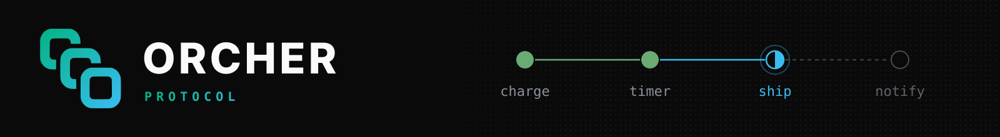

<p>
  <picture>
    <source media="(prefers-color-scheme: dark)" srcset="./assets/banner.svg">
    <source media="(prefers-color-scheme: light)" srcset="./assets/banner-light.svg">
    
  </picture>
</p>

<p align="center"><sub>The ORCHER API, defined once in Protocol Buffers and shared by the engine and every SDK.</sub></p>

<br />

<div>
  <a href="https://crates.io/crates/orcher-proto"></a>
  <a href="https://docs.rs/orcher-proto"></a>
  <a href="https://github.com/orcher-io/protos/actions/workflows/ci.yml"></a>
  <a href="./LICENSE"></a>
</div>

<br />

The `.proto` files are the source of truth for the ORCHER gRPC API, and `orcher-proto` is the Rust crate generated from them.

-  **One package**: every service and message lives in `orcher.v1`, under `proto/`
-  **Rust bindings**: tonic clients and servers, re-exported at the crate root
-  **No `protoc` needed**: the crate compiles the files with a protobuf compiler written in Rust
-  **Any language**: generate clients for Go, TypeScript, Python and more from the same files
-  **Compatible by rule**: CI rejects any wire- or JSON-breaking change, and field numbers are never reused

<br />

###  Install

```toml
[dependencies]
orcher-proto = "0.1"
tokio = { version = "1", features = ["full"] }
```

> [!NOTE]
> These are raw bindings. To write workflows, use an SDK instead: [`orcher-sdk`](https://crates.io/crates/orcher-sdk) for Rust or [`@orcher/sdk`](https://www.npmjs.com/package/@orcher/sdk) for TypeScript. The API is pre-1.0 and may change between minor releases; every change is listed in [CHANGELOG.md](CHANGELOG.md).

<br />

###  Use from Rust

Everything in `orcher.v1` is re-exported at the crate root, along with the `tonic`, `prost` and `prost-types` versions the bindings were built with:

```rust
use orcher_proto::workflow_service_client::WorkflowServiceClient;
use orcher_proto::StartWorkflowRequest;

#[tokio::main]
async fn main() -> Result<(), Box<dyn std::error::Error>> {
    let mut client = WorkflowServiceClient::connect("http://localhost:50051").await?;

    let response = client
        .start_workflow(StartWorkflowRequest {
            workflow_id: "order-1001".into(),
            workflow_type: "confirm_order".into(),
            task_queue: "orders".into(),
            namespace: "default".into(),
            input: br#"{"id":"order-1001"}"#.to_vec(),
            ..Default::default()
        })
        .await?;

    println!("started execution {}", response.into_inner().execution_id);
    Ok(())
}
```

<br />

###  Other languages

Generate code from the files in `proto/` with your language's protobuf toolchain:

```bash
# Go
protoc -Iproto --go_out=. --go-grpc_out=. proto/*.proto

# TypeScript (protobuf-ts)
npx protoc -Iproto --ts_out=src/generated proto/*.proto

# Python (grpcio-tools)
python -m grpc_tools.protoc -Iproto --python_out=. --grpc_python_out=. proto/*.proto
```

<br />

###  Proto files

| File | Contents |
|------|----------|
| `types.proto` | Shared types: payloads, retry policy, failures, statuses, journal entries and commands |
| `workflow_service.proto` | `WorkflowService`: start, query, update, cancel and reset workflows, and send them events |
| `execution_service.proto` | `ExecutionService`: poll for and report workflow and task work |
| `query_service.proto` | `QueryService`: list, search and inspect workflow executions |
| `actor_service.proto` | `ActorService`: stateful actors addressed by type and key |
| `worker_service.proto` | `WorkerService`: worker registration and heartbeats |
| `namespace_service.proto` | `NamespaceService`: namespace management |

<br />

###  How it fits

| Layer | Package | Repository |
|-------|---------|------------|
| API definitions | [`orcher-proto`](https://crates.io/crates/orcher-proto) | [orcher-io/protos](https://github.com/orcher-io/protos) |
| SDK core | [`orcher-sdk-core`](https://crates.io/crates/orcher-sdk-core) | [orcher-io/sdk-core](https://github.com/orcher-io/sdk-core) |
| Rust SDK | [`orcher-sdk`](https://crates.io/crates/orcher-sdk) | [orcher-io/sdk-rust](https://github.com/orcher-io/sdk-rust) |
| TypeScript SDK | [`@orcher/sdk`](https://www.npmjs.com/package/@orcher/sdk) | [orcher-io/sdk-ts](https://github.com/orcher-io/sdk-ts) |

The engine serves this API, `orcher-sdk-core` speaks it on behalf of every language SDK, and the SDKs give it an idiomatic face.

<br />

###  Contributing

Issues and pull requests are welcome. See [CONTRIBUTING.md](CONTRIBUTING.md) for how to build, test and propose a change.

###  License

Licensed under the [Apache License, Version 2.0](LICENSE).
